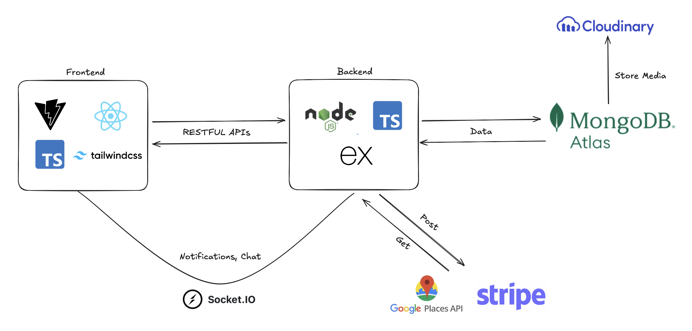
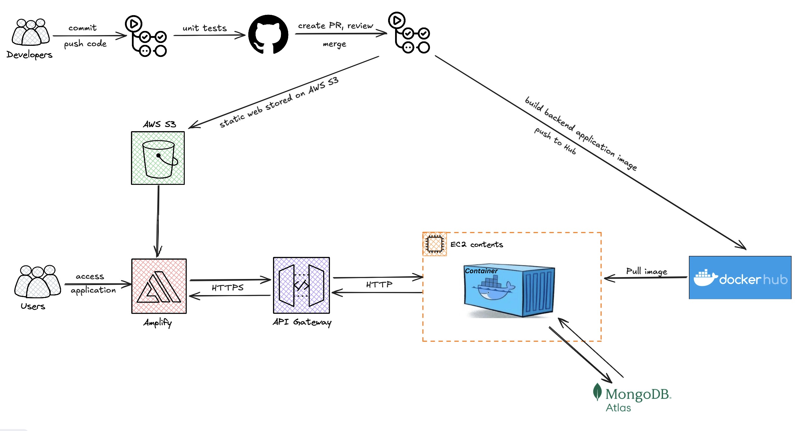

# Local Taste - one plate at a time

Looking for a more authentic way to experience a new place? Discover home-cooked meals, explore hidden neighborhood restaurants, join unique food events, and share unforgettable moments with hosts who know the city best. Local Taste helps travelers connect with people, stories, and places — all through the shared joy of cuisine, one plate at a time.

screenshots go here

## Contributors

- Nhat Le
- Quy Nguyen
- Dan Nguyen
- Tam Nguyen

Special thanks to our project advisors:

- Khoa Le
- Jenny
- Hai Anh

## Technologies

- Front-end: React.js (TypeScript), Shadcn UI, TailwindCSS, Socket.io (Client)
- Back-end: Node.js (TypeScript), Express, Socket.io (Server)
- Database: MongoDB, Cloudinary
- APIs / External Integrations: Google Maps / Places, Google OAuth, Stripe Payments, Cloudinary, WebSocket
- Testing: Jest, Vitest
- Deployment:

### System Design Flow

**System Design Diagram**

**Deploy Diagram**

## Features

### 1. Authentication and authorization

* Secure login with JWT-based authentication.
Supports Google OAuth for quick sign-in.

* Two primary user roles:
  * Guest (Traveler): Discover and book authentic experiences.
  * Host: Share your culture and cuisine with travelers.

### 2. Browse and view upcoming events

**Dashboard view**

* Guests: View recommended upcoming food events.
* Hosts: See requests from travelers wanting to join.
* Track confirmed bookings in one place.

**All events field**

- View more events per page, with dynamic filters to select relevant experiences

### 3. Find nearby events and places with Google Maps!

- View the location and detail of nearby events on Google Maps

- Discover new places with fetched ratings and information from Google Maps

### 4. Book and checkout an experience

- For guests: Confirm your interest in joining a local host on an event. Note that the decision depends on the host

- For experiences with a fee associated: checkout securely with payment supported by Stripe! Once the host approve your booking, payment will be authorized and sent to the host from Stripe.

### 5. [Host] Manage your Listed Experiences

- View guests that indicated interest in your booking and approve/reject the requests.

### 6. Chat with hosts/guests

- Contact the host about an experience via chat to ask questions!

- For confirmed experience, a broadcast channel or group chat can be created to streamline communication.

### 7. Social Feed and Real-time Notifications

- Write, share, and view friends' posts about traveling and cuisine.

- Link your post to a recent experience to spread and share with other people!

- Like and comment on other's post to express interest!

**Notifications**

- Get real-time nofitications when people interacted with your post.

### 8. Manage and View Profiles

- View other's profiles, including their basic informations, recent posts and reviews, and some fun statistics

- Manage and edit your own profile, including profile and cover pictures

